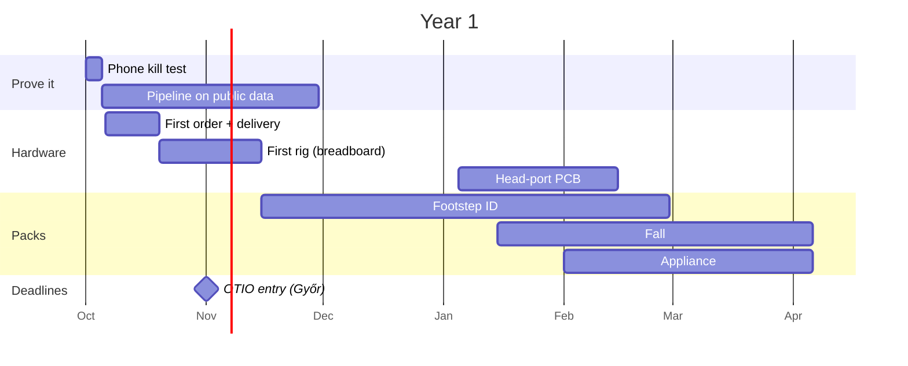

# Roadmap

Year 1 only. Milestones live in this note's properties; the dashboard reads them from there. Dates after November are targets, not commitments.

```mermaid
gantt
    title Year 1
    dateFormat YYYY-MM-DD
    axisFormat %b
    section Prove it
    Phone kill test            :a1, 2026-10-01, 4d
    Pipeline on public data    :a2, 2026-10-05, 2026-11-30
    section Hardware
    First order + delivery     :b1, 2026-10-06, 14d
    First rig (breadboard)     :b2, 2026-10-20, 2026-11-15
    Head-port PCB              :b3, 2027-01-05, 2027-02-15
    section Packs
    Footstep ID                :c1, 2026-11-15, 2027-02-28
    Fall                       :c2, 2027-01-15, 2027-04-06
    Appliance                  :c3, 2027-02-01, 2027-04-06
    section Deadlines
    OTIO entry (Győr)          :milestone, m1, 2026-11-01, 0d
```
